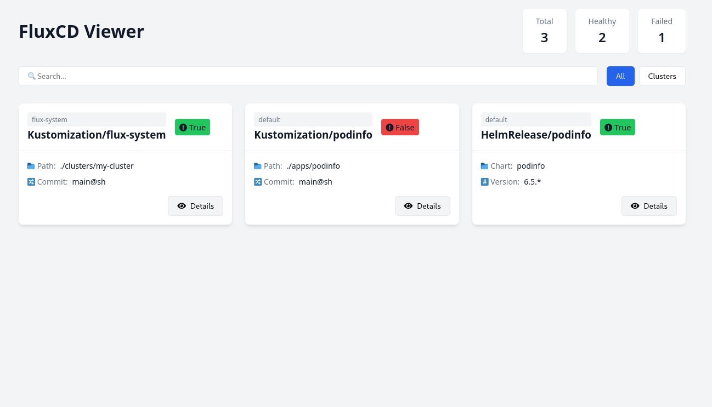

# 🚀 FluxCD Viewer

FluxCD Viewer is a lightweight web interface for visualizing and monitoring the state of your FluxCD Kustomizations in your Kubernetes cluster.

## 🎯 Features

- Overview of FluxCD Kustomizations
- Real-time deployment status  
- Grouping by categories (apis, apps, addons)
- Detailed conditions and error messages



## 🛠️ Prerequisites

- Kubernetes cluster with FluxCD installed
- Configured kubectl access (kubeconfig file)

## 📦 Installation

### Option 1: Docker

```bash
# Run container with mounted kubeconfig
docker run -p 8080:8080 \
 -v ~/.kube/config:/root/.kube/config \
 didlawowo/fluxcd-viewer:latest
```

### Option 2 : Helm

```
cd helm
helm install fluxcd-viewer
```

## 📝 Configuration

The application uses the following environment variables:

| Variable | Description              | Default |
| -------- | ------------------------ | ------- |
| `PORT`   | listening port           | `8080`  |

## 🔍 Usage

Access the web interface: <http://localhost:8080>
The interface automatically displays your Kustomizations
Click on a Kustomization to see its details

## 🏗️ Local Developpment

### Clone the repo

```bash
git clone https://github.com/didlawowo/fluxcd-viewer.git
cd fluxcd-viewer
```

### Install dependencies

```bash
go mod download
```

### Run locally

```bash
go run main.go
```

## 🔐 Security

The application requires read-only access to FluxCD resources. The chart creates a service account with minimal required permissions. The ingress is configured to expose the service.

## 📝 Contributing

Contributions are welcome! Please open an issue or submit a pull request.

## 📝 Credits

This project was inspired by the need for a simple and lightweight web interface to view FluxCD Kustomizations.

## 📄 Licence

MIT
